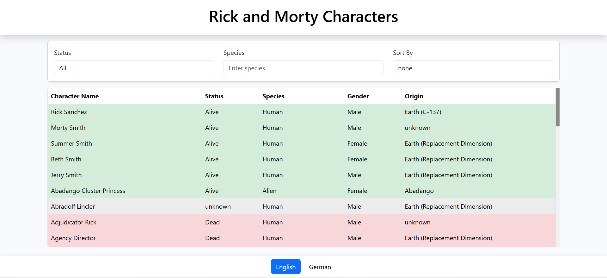
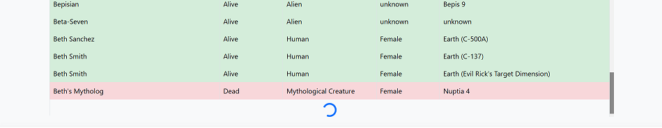
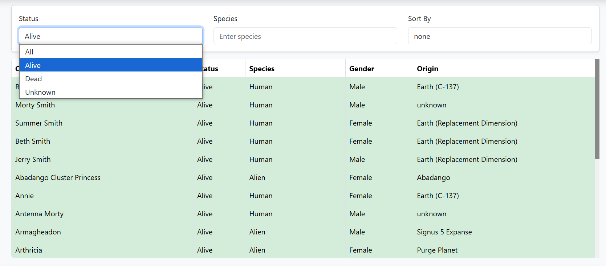
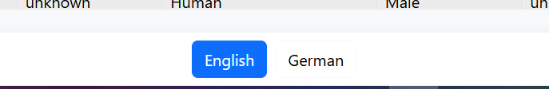

# 🚀 **Rick and Morty Characters**

This project displays a list of characters from the Rick and Morty TV series using the Rick and Morty API. The app includes features such as filtering, sorting, infinite scrolling, and language switching. It uses React, Apollo Client, and other modern libraries to provide a smooth and interactive user experience.

---
## 🛠️ **Setup Guide**

### 1. **Clone the Repository**

Clone the repository to your local machine using the following command:

```bash
git clone <REPOSITORY_URL>
```

### 2. **Install Dependencies**
```bash
cd List-Rick-and-Morty-Characters
```
```bash
npm install --legacy-peer-deps
```

### 3. **Run the Project**
```bash
npm start
```
---
## 🛠️ **Features**

### **User Side:**
- **📜 Character List:**  
  List of characters fetched from the Rick and Morty API.  
  

- **🔄 Infinite Scrolling:**  
  Load more characters automatically as you scroll down the page.
  

- **🛠 Filtering:**  
  Filter characters by status (alive, dead, or unknown) and species.
  

- **⚙️ Sorting:**  
  Sort characters by name or origin.

- **🌍 Language Switcher:**  
  Switch between multiple languages using `i18next`.  
  

